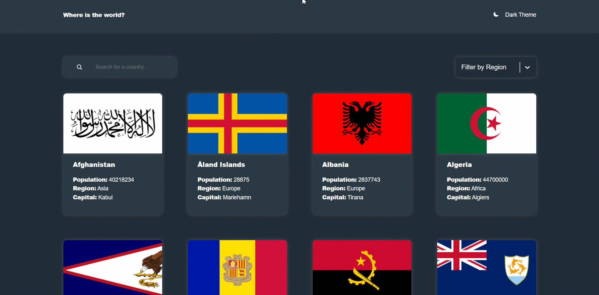

# :earth_americas: Countries App

<h3 align="center"><a href="" target="_blank">Demo</a></h3>

Приложение для просмотра списка стран с детальной информацией о каждой. Доступна фильтрация по регионам и текстовый поиск.

---

## How it works

## :hammer_and_wrench: Технологии

- TypeScript
- React
- Redux Toolkit
- React Router
- Styled Components
- HTML
- CSS-in-JS

---

## :heavy_check_mark: Функционал

- Просмотр списка всех стран на главной странице.
- Просмотр подробной информации о каждой стране на отдельной странице.
- Поиск страны по названию.
- Фильтрация стран по регионам.
- Перелинковка между страницами по странам-соседям.
- Переключение темы с сохранением в localStorage, определение системной темы оформления.

---

## Быстрый старт

- Клонируйте репозиторий: `git clone https://github.com/AsotikovaSvetlana/countries.git`
- Перейдите в папку с проектом: `cd countries`
- Установите зависимости: `npm install`
- Запустите проект: `npm start`
